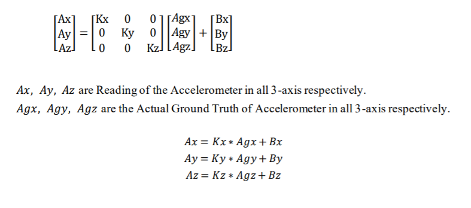
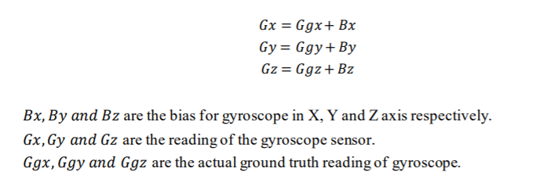
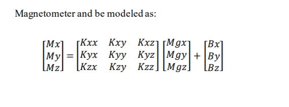
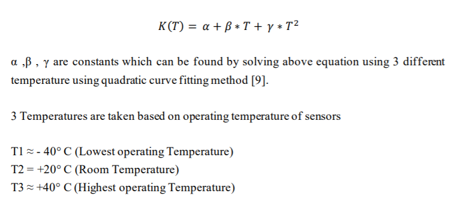

# IMU-calibration
IMU sensors are calibrated using the built in tool

This project creates a tool to calibrate the IMU sensors i.e Accelerometer , Gyroscope and Magnetometer

Front end design of the tool looks like this

Accelerometer calibration :

Accelerometer sensor can be modeled as

Gyroscope Calibration :

Gyroscope  sensor can be modeled as

To Do list :

Magnetometer Calibration :

Magnetometer  sensor can be modeled as

Temperature Calibration :

IMU sensors are sensitive to temperature so does the calibration parameters.
Temperature dependency of parameters are modeled as quadratic equation. 

