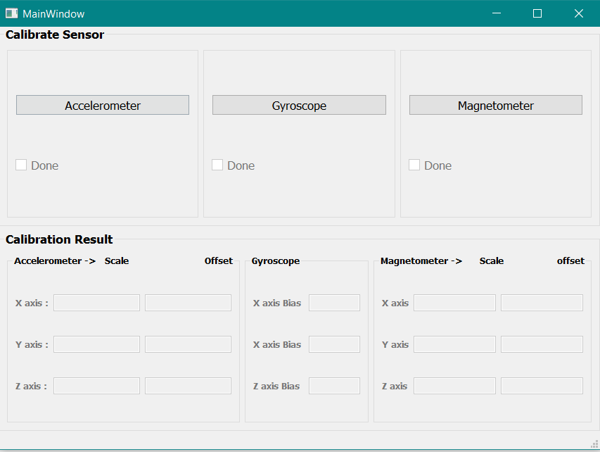

# IMU-calibration
IMU sensors are calibrated using the built in tool

This project creates a tool to calibrate the IMU sensors i.e Accelerometer , Gyroscope and Magnetometer

Front end design of the tool looks like this

Accelerometer calibration :

Gyroscope Calibration :

Magnetometer Calibration : 

